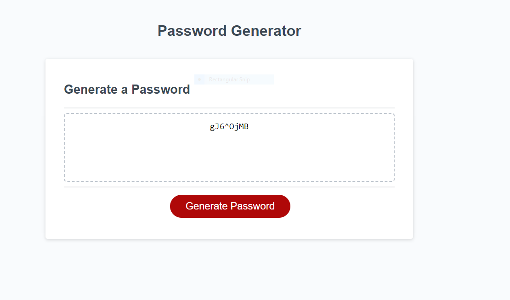

# Password-Generator

Overview

The Password Generator is a web application designed to assist users in creating strong and secure passwords. The tool prompts users to specify the length of the password and allows them to select various character types. These character types consist of lowercase letters, uppercase letters, numbers, and special characters.

Collaborative Effort

This project presented several challenges for me, and I received invaluable assistance from my tutor, Trinh Nguyen. 
The development of the getPasswordOptions() function was a collaborative effort between a TA, fellow students, and myself during a classroom session. 

Application Features

Password Customization

The Password Generator provides users with the flexibility to customize their passwords according to their security preferences. Users can:

    Define the length of the password, ensuring it meets their security requirements.
    Choose to include lowercase letters, uppercase letters, numbers, and special characters in the password.

Randomized Password Generation

When users select their preferences, the application use JavaScript to generate a randomized password that meets the specified criteria. Then the generated password is displayed in the window, allowing users to copy it.

Application Usage

1. Open the deployed application.
2. Click the "Generate Password" button.
3. Follow the prompts to select the desired password length and character types.
4. Once selections are made, the generated password will be displayed.

Technologies Used

- HTML
- CSS
- JavaScript

Acknowledgments

I extend my heartfelt thanks to Trinh Nguyen for her unwavering support and guidance throughout the development of this application. Her expertise and encouragement significantly contributed to overcoming the challenges faced during this project.

This detailed description provides an overview of the Password Generator application, highlighting its features, collaborative development process, usage instructions, technologies utilized, and acknowledgment of the support received.

Application Screenshot

## Github Application URL

Application GitHub URL: https://github.com/RusLena/Secure-Passwords-Generator.git

## Deployed Application

[Click here to access the deployed Password Generator]https://ruslena.github.io/Secure-Passwords-Generator/

Besr Regards,
Elena
